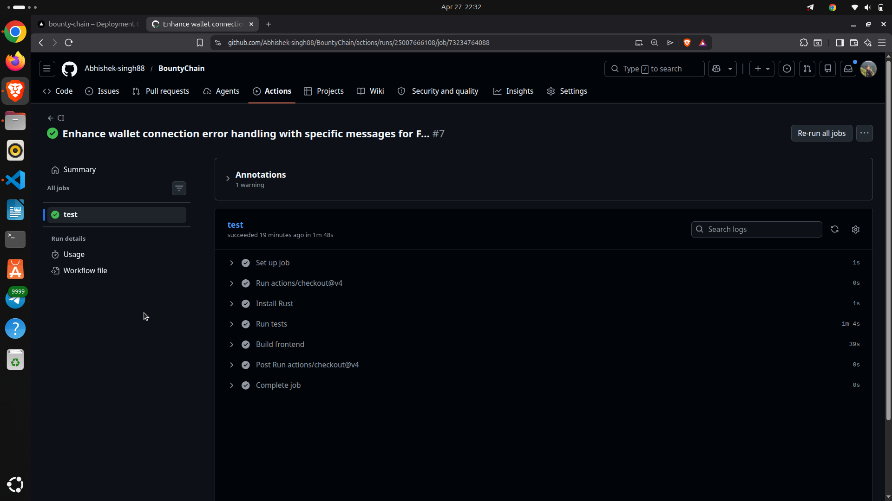
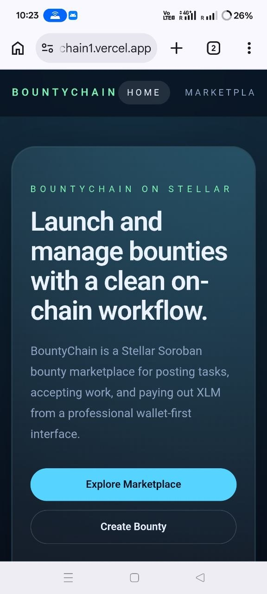

# BountyChain

BountyChain is a decentralized bounty marketplace built on Stellar Soroban.

Creators post bounties in XLM, workers accept them, submit work, and the creator approves payout from a clean multi-page frontend.
The app uses Soroban contract calls, real-time contract events, Freighter wallet integration, and a responsive production UI.

## Live Demo

- Demo Video Link: https://drive.google.com/file/d/1BiyhnWiyAZcVs-YguLPDD3WV7fCInzsz/view?usp=sharing

- Production app: https://bounty-chain1.vercel.app/

Important:
- Freighter must be installed in the browser.
- On first connect, approve this deployed Vercel domain in Freighter's Connected Apps list.
- The deployed app is on Stellar testnet.

## What This Project Demonstrates

- Inter-contract call pattern on Stellar Soroban
- Bounty lifecycle management
- Wallet-first UX with Freighter
- Real-time state updates through contract reads and events
- Mobile responsive frontend
- CI/CD via GitHub Actions
- Production deployment on Vercel

## Architecture

### Frontend

- Next.js App Router
- TypeScript
- Tailwind CSS
- Freighter wallet integration

### Routes

- `/` - marketing landing page
- `/marketplace` - open bounties only
- `/active` - accepted and submitted bounties
- `/completed` - paid bounties
- `/create` - create bounty only
- `/bounties/[id]` - bounty lifecycle detail view

### Contract Flow

`bounty_contract` is the main contract.

It stores bounty records and handles:
- create bounty
- accept bounty
- submit work
- approve and pay

It also performs the payout transfer through an inter-contract call into the native Stellar asset contract.

### Deployed Contract

- Bounty contract ID: `CDYAO7KYUBMTCBZSSVT5ZHPFYNJ7GYTX4HTSD44CKCAYWW25BSPYGVVU`

If you redeploy the contract, update the frontend environment variable and this README.

### Native Asset

- Stellar native asset contract ID: `CDLZFC3SYJYDZT7K67VZ75HPJVIEUVNIXF47ZG2FB2RMQQVU2HHGCYSC`

## Bounty Lifecycle

1. Creator opens `/create`
2. Creator publishes a bounty with XLM
3. Worker opens `/marketplace`
4. Worker accepts the bounty
5. Worker submits work on `/active`
6. Creator approves and pays the bounty
7. The bounty appears in `/completed`

Current status flow:
- `OPEN`
- `ACCEPTED`
- `SUBMITTED` or `COMPLETED` depending on contract state compatibility
- `PAID`

## Features

- Connect Freighter wallet
- Show wallet address
- Read XLM balance on testnet
- Create bounty
- Browse open bounties
- Accept bounty
- Submit work
- Approve and pay
- Route-based UI for marketplace, active, completed, and create screens
- Mobile responsive layout
- Contract event support

## CI/CD

GitHub Actions workflow:
- `.github/workflows/ci.yml`

It runs:
- `cargo test`
- `npm install`
- `npm run build`

CI badge or screenshot:



## Mobile Screenshot

Add your mobile responsive screenshot here:



## Screenshots

Suggested screenshots for submission:
- Landing page
- Marketplace page
- Active page
- Completed page
- Mobile responsive view
- CI/CD pipeline running

## Setup

### Prerequisites

- Rust toolchain
- Node.js 18+
- Freighter browser extension
- Stellar testnet account

### Local Development

Clone the repo and install dependencies:

```bash
cd Bountychain
cd frontend
npm install
npm run dev
```

Open:

- http://localhost:3000

### Contract Build

Build and test the contract:

```bash
cargo test
```

## Frontend Environment

If you need to override the deployed testnet contract ID, create `frontend/.env.local`:

```bash
NEXT_PUBLIC_BOUNTY_CONTRACT_ID=CDYAO7KYUBMTCBZSSVT5ZHPFYNJ7GYTX4HTSD44CKCAYWW25BSPYGVVU
NEXT_PUBLIC_STELLAR_RPC_URL=https://soroban-testnet.stellar.org
NEXT_PUBLIC_STELLAR_NETWORK_PASSPHRASE=Test SDF Network ; September 2015
```

## Notes for Judges

- Freighter approval is required once per browser origin.
- The production app is hosted on Vercel.
- The app is optimized for mobile and desktop.
- Bounty data updates after each action.

## Production Checklist

- Public GitHub repository
- Live demo link
- Mobile responsive screenshot
- CI/CD screenshot or badge
- Contract address included above
- Transaction hash to add from the final contract deployment

## Transaction Hash

Add the final bounty contract deployment transaction hash here before submission:

- `TODO: add Stellar testnet deployment transaction hash`

## Commit Count

The repository includes more than 8 meaningful commits, satisfying the submission requirement.

